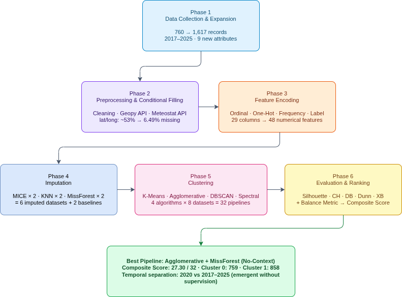
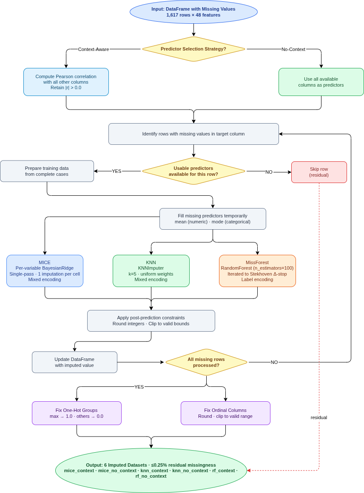
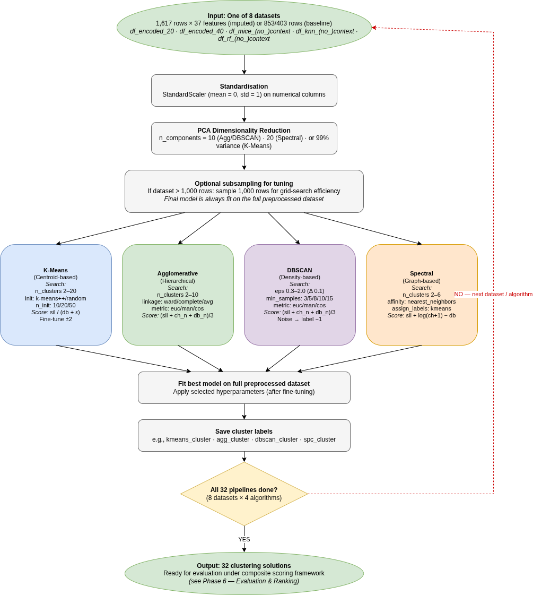
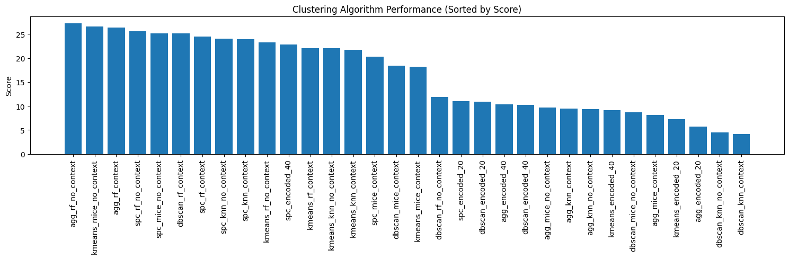
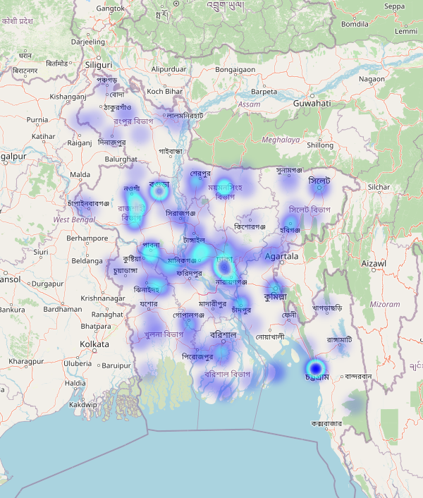
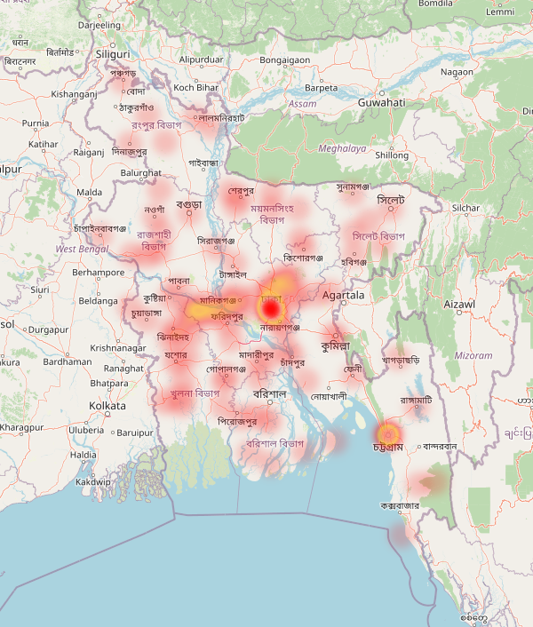
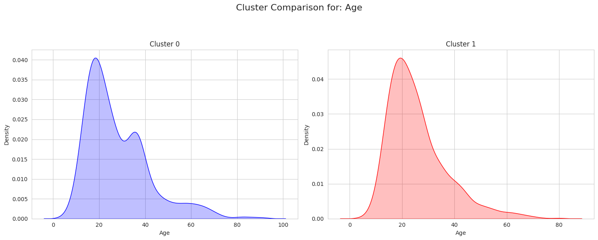
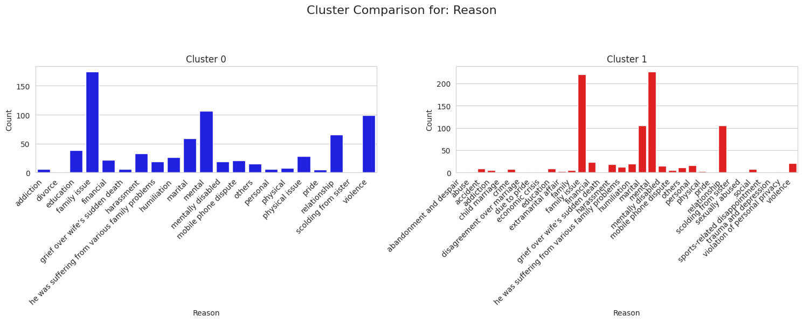

<!-- _class: title-slide -->

<svg class="title-motif" width="180" height="60" viewBox="0 0 180 60">
  <circle cx="70" cy="30" r="20" fill="none" stroke="#5EEAD4" stroke-width="1.5" opacity="0.85"/>
  <circle cx="100" cy="30" r="22" fill="none" stroke="#34D399" stroke-width="1.5" opacity="0.85"/>
  <circle cx="15" cy="15" r="1.8" fill="#EAEAEA" opacity="0.55"/>
  <circle cx="30" cy="48" r="1.8" fill="#EAEAEA" opacity="0.45"/>
  <circle cx="158" cy="18" r="1.8" fill="#EAEAEA" opacity="0.55"/>
  <circle cx="168" cy="44" r="1.8" fill="#EAEAEA" opacity="0.45"/>
  <circle cx="45" cy="55" r="1.5" fill="#FBBF24" opacity="0.6"/>
  <circle cx="135" cy="8"  r="1.5" fill="#F87171" opacity="0.5"/>
</svg>

<h1>Comparing Imputation and Clustering Pipelines on Incomplete Newspaper-Reported Suicide Data from Bangladesh</h1>

A 32-pipeline factorial benchmark with a balance-aware composite score

BUBT · DEPARTMENT OF CSE · CAPSTONE DEFENSE · JUNE 2026

---

<h3 class="label">The Team</h3>

  

    
photo 1

    
[Name 1]

    
Project Lead Pipeline Architecture

  

  

    
photo 2

    
[Name 2]

    
Data Collection and Curation

  

  

    
photo 3

    
[Name 3]

    
Imputation and Clustering Pipeline

  

  

    
photo 4

    
[Name 4]

    
Evaluation Framework and Scoring

  

  

    
photo 5

    
[Name 5]

    
Documentation and Visualisation

  

---

<!-- _class: left -->

<h3 class="label">Outline</h3>

  
01Background and the data problem

  
02Literature review and the gap we fill

  
03Research question and objectives

  
04Methodology — the 32-pipeline benchmark

  
05Results, cluster profiles, feature comparison

  
06Honest findings, limitations, what's next

---

SECTION 01

<h1 class="section-divider-title">Background</h1>

---

<h1>Suicide in Bangladesh.</h1>

A public-health crisis without a national surveillance system.

---

40

suicides per day in Bangladesh

Source · Bangladesh Police (AIG Ashraful Islam) · reported by Prothom Alo, 2025

---

73,597

Bangladesh Police records, 2020 – 2024 Average: <strong>14,719 per year</strong>

Source · Bangladesh Police nationwide data, 2025

---

<h2 class="amber">The true figure is higher.</h2>

Stigma. Cultural barriers. No surveillance system.

Reasoning · WHO; Arafat et al., 2025

---

  

  

  

  

  

  

  

Newspaper reports are the only structured data we have.

---

50–90%

of critical fields are missing

  0%
  50%
  90%
  100%

Measured directly on the curated dataset · this study

---

<!-- _class: left -->

<h3 class="label">What is systematically missing</h3>

· Age, occupation, marital status

· Mental-health history

· Socio-economic indicators

· Latitude, longitude

· Weather and environmental context

---

<h2 class="amber">Standard machine learning cannot run on data this broken.</h2>

Complete-case analysis discards most of the dataset. Naïve mean substitution introduces distributional bias.

---

SECTION 02

<h1 class="section-divider-title">Literature</h1>

---

<!-- _class: left -->

<h3 class="label">Prior work — Bangladeshi newspaper suicide research</h3>

  Arafat et al.2018
  
Demography and risk factors of suicidal behavior in Bangladesh: retrospective online news content analysis

  
Manual grouping only — <strong class="amber">no algorithmic clustering applied.</strong>

  Arafat et al.2025
  
Prevalence of suicidal behavior in Bangladesh: A systematic review and meta-analysis

  
Aggregate epidemiology — <strong class="amber">no case-level subgroup analysis.</strong>

---

<!-- _class: left -->

<h3 class="label">Prior work — algorithmic clustering on suicide data</h3>

  Wong et al.2022
  
Classification of school student suicides using cluster analysis · Hong Kong

  
K-Means on structured records — <strong class="amber">single algorithm, no imputation comparison.</strong>

  Xiao et al.2025
  
Machine learning on social determinants of suicide · United States

  
Community-level K-Means — <strong class="amber">administrative data, not severely incomplete.</strong>

  Sanz-Gomez et al.2025
  
Impulsivity-based pathways to suicide deaths: cluster analysis · Spain

  
Autopsy data, K-Means + Agglomerative — <strong class="amber">no LMIC newspaper context.</strong>

---

<!-- _class: left -->

<h3 class="label">The five gaps we fill</h3>

<strong class="cyan">01</strong> &nbsp; No algorithmic clustering on Bangladeshi newspaper suicide data

<strong class="cyan">02</strong> &nbsp; No multi-method imputation benchmark in this domain

<strong class="cyan">03</strong> &nbsp; Prior studies use a single clustering algorithm — we use four

<strong class="cyan">04</strong> &nbsp; Standard validity indices fail on imbalanced social data — we propose a balance penalty

<strong class="cyan">05</strong> &nbsp; No prior work compares predictor-selection strategies during imputation

---

SECTION 03

<h1 class="section-divider-title">Research</h1>

---

<h3 class="label">Research Question</h3>

<em>Which combination of missing-data handling and unsupervised learning produces the most stable, interpretable cluster structure from Bangladeshi newspaper suicide records?</em>

---

<!-- _class: left -->

<h3 class="label">Objectives</h3>

<strong class="cyan">01</strong> &nbsp; Expand and curate a Bangladeshi newspaper suicide dataset across 2017–2025.

<strong class="cyan">02</strong> &nbsp; Benchmark three imputation methods × two predictor strategies × four clustering algorithms.

<strong class="cyan">03</strong> &nbsp; Design a balance-aware composite metric that demotes degenerate cluster solutions.

<strong class="cyan">04</strong> &nbsp; Identify and interpret the top pipeline — and surface its caveats openly.

---

SECTION 04

<h1 class="section-divider-title">Methodology</h1>

---

<h3 class="label">End-to-end pipeline</h3>

  

From newspaper scraping through cleaning, enrichment, imputation, clustering, and composite evaluation.

---

1,617

records · 36 columns · 2017 to 2025

<strong class="cyan">760</strong> Kaggle 2020 &nbsp;·&nbsp; <strong class="cyan">857</strong> manually collected &nbsp;·&nbsp; <strong class="cyan">9</strong> new attributes

Source · this study · github.com/akashmony01/imputation-clustering-comparison

---

<h2>A factorial benchmark.</h2>

3 imputers &nbsp;×&nbsp; 2 strategies &nbsp;×&nbsp; 4 clusterers

  

  

  

  

  24 imputed
  8 baseline
  <strong>= 32 pipelines</strong>

---

<h3 class="label">Imputation workflow</h3>

  

MICE · KNN · MissForest, each under context-aware and no-context predictor strategies.

---

<h3 class="label">Clustering workflow</h3>

  

Standardisation · PCA · per-algorithm grid search · composite ranking across all 32 pipelines.

---

<h2 class="amber">Standard scores reward degenerate solutions.</h2>

DBSCAN can label <strong style="color:#FBBF24;">99%</strong> of cases as noise and still post a high Silhouette score.

---

<h3 class="label">Our six-component composite</h3>

  

    Balance penalty
    

    35%
  

  

    Silhouette
    

    25%
  

  

    Calinski–Harabasz
    

    20%
  

  

    Dunn
    

    10%
  

  

    Davies–Bouldin
    

    5%
  

  

    Xie–Beni
    

    5%
  

Maximum possible score: <strong style="color:#EAEAEA;">32</strong>

---

SECTION 05

<h1 class="section-divider-title">Results</h1>

---

<h3 class="label">All 32 pipelines · ranked by composite score</h3>

  

The full ranking. Agglomerative + MissForest no-context leads the field.

---

<h3 class="label">The top-ranked pipeline</h3>

<h2 class="cyan">Agglomerative + MissForest</h2>

no-context

Ranked first among all 32 pipelines

---

27.30

out of <strong>32</strong>

Composite score · this study · across 32 pipelines

---

<h2>Two clusters.</h2>

  

    Cluster 0
    759
  

  

    Cluster 1
    858
  

Near-balanced partition from 1,617 records

---

<!-- _class: left -->

<h3 class="label">Cluster 0</h3>

<strong>Semi-urban workplaces</strong> (54.5%)

Hometowns dispersed across mid-sized provincial cities.

Bogura &nbsp;·&nbsp; Rajshahi &nbsp;·&nbsp; Mymensingh

All records: year 2020 (Kaggle subset)

---

<!-- _class: left -->

<h3 class="label">Cluster 1</h3>

<strong>Rural workplaces</strong> (50.0%)

Hometowns concentrated at the two largest cities.

Dhaka (9.1%) &nbsp;·&nbsp; Chattogram (7.7%)

All records: 2017–2019 + 2021–2025 (manual)

---

<h3 class="label">Feature-by-feature contrast</h3>

<table class="compare-table">
  <tr>
    <th>Feature</th>
    <th>Cluster 0</th>
    <th>Cluster 1</th>
  </tr>
  <tr>
    <td class="feat">Workplace (modal)</td>
    <td class="c0">Semi-urban · 54.5%</td>
    <td class="c1">Rural · 50.0%</td>
  </tr>
  <tr>
    <td class="feat">Hometown (top 1)</td>
    <td class="c0">Bogura · 4.0%</td>
    <td class="c1">Dhaka · 9.1%</td>
  </tr>
  <tr>
    <td class="feat">Year coverage</td>
    <td class="c0">2020 only</td>
    <td class="c1">2017–2025</td>
  </tr>
  <tr>
    <td class="feat">Cluster size</td>
    <td class="c0">759</td>
    <td class="c1">858</td>
  </tr>
  <tr>
    <td class="feat">Source cohort</td>
    <td class="c0">Kaggle 2020</td>
    <td class="c1">Manual collection</td>
  </tr>
</table>

---

<h3 class="label">Age distribution by cluster</h3>

  

Cluster 1 skews slightly older. Both clusters concentrate in the 16–35 high-risk window.

---

<h3 class="label">Reason for suicide · cluster comparison</h3>

  

Family conflict and relationship-related distress dominate in both clusters; weighting differs across the two cohorts.

---

SECTION 06

<h1 class="section-divider-title">Honest Findings</h1>

---

<h3 class="label" style="color:#FBBF24;">An honest finding</h3>

The two clusters align with the <strong class="amber">data-collection boundary</strong>, not with two distinct epidemiological groups.

---

<!-- _class: left -->

<strong class="cyan">Cluster 0</strong> = all 2020 (Kaggle subset)

<strong class="cyan">Cluster 1</strong> = 2017–2019 + 2021–2025 (manually collected)

The algorithm never saw the year. The split is <strong>emergent</strong>.

An internal consistency check — not a substantive epidemiological finding.

---

<!-- _class: left -->

<h3 class="label" style="color:#FBBF24;">Caveats — disclosed in the abstract</h3>

<strong class="amber">Source-cohort confound</strong> cluster split coincides with data origin

<strong class="amber">Temperature units differ</strong> Kelvin in Cluster 0 · Celsius in Cluster 1

<strong class="amber">De-identified, not anonymised</strong> residual re-identification risk acknowledged

---

<!-- _class: left -->

<h3 class="label">Limitations</h3>

Newspaper bias toward newsworthy cases

Small sample by ML standards

No external ground-truth labels

Bangla NLP excluded from free-text fields

Weather data sparse in rural areas

---

SECTION 07

<h1 class="section-divider-title">What's Next</h1>

---

<!-- _class: left -->

<h3 class="label" style="color:#34D399;">Future work</h3>

<strong class="green">·</strong> &nbsp; Causal modelling beyond descriptive clustering

<strong class="green">·</strong> &nbsp; BanglaBERT for free-text reason and profession fields

<strong class="green">·</strong> &nbsp; Real-time alerting for high-risk demographic profiles

<strong class="green">·</strong> &nbsp; Extension to other LMIC newspaper datasets

---

<!-- _class: left -->

<h3 class="label" style="color:#34D399;">Contribution</h3>

The <strong class="green">largest curated</strong> Bangladeshi newspaper suicide dataset to date

A <strong class="green">reproducible</strong> 32-pipeline benchmark

A <strong class="green">balance-aware</strong> composite metric

<strong class="green">Open-source</strong> release: code + data + 12 notebooks

---

<h3 class="label" style="color:#34D399;">Repository</h3>

github.com/akashmony01/ imputation-clustering-comparison

Code: <strong style="color:#EAEAEA;">MIT</strong> &nbsp;·&nbsp; Data: <strong style="color:#EAEAEA;">CC-BY 4.0</strong>

12 Colab notebooks · intermediate datasets · cached API responses

---

<h2>Thank you.</h2>

Questions?

